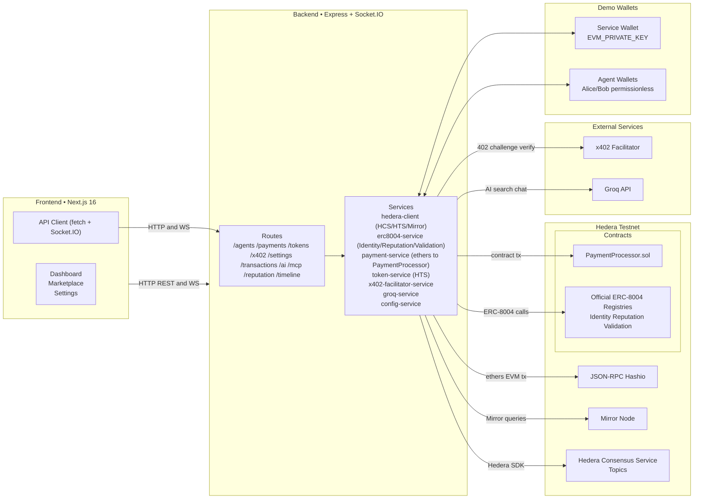
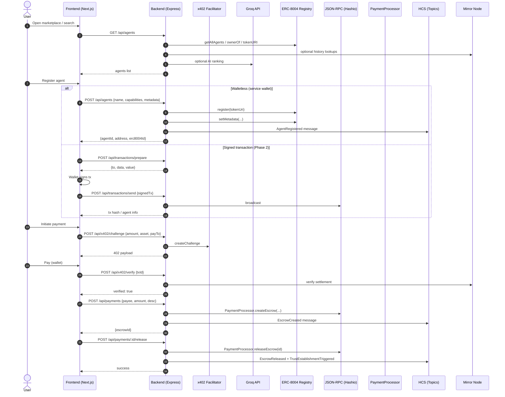

# Heracles

Agent-first Digital Economy on Hedera.

## Team members

<table>
	<tbody>
        <tr>
            <td align="center">
                <a href="https://github.com/richardleii58">
                    
                    <br />
                    <sub><b>Richard Lei</b></sub>
                </a>
            </td>
            <td align="center">
                <a href="https://github.com/gongahkia">
                    
                    <br />
                    <sub><b>Gabriel Ong</b></sub>
                </a>
                <br />
            </td>
            <td align="center">
                <a href="https://github.com/le-xuan-2">
                    
                    <br />
                    <sub><b>Tan Le Xuan</b></sub>
                </a>
                <br />
            </td>
            <td align="center">
                <a href="https://github.com/aryapple">
                    
                    <br />
                    <sub><b>Arya Govind</b></sub>
                </a>
                <br />
            </td> 
        </tr>
	</tbody>
</table>

## Quickstart

Prereqs
- Node.js 18+
- A Hedera testnet account (Account ID + Ed25519 private key)
- An ECDSA private key (0x… hex) for EVM transactions (ethers/Hardhat)

1) Configure environment

Copy .env.example to .env and fill these minimum values (root of repo):

```env
# Network and RPC
HEDERA_NETWORK=testnet
RPC_URL=https://testnet.hashio.io/api
MIRROR_NODE_URL=https://testnet.mirrornode.hedera.com/api/v1

# Hedera operator (Hedera SDK / HCS, HTS)
HEDERA_ACCOUNT_ID=0.0.xxxxx
HEDERA_PRIVATE_KEY=302e0201...

# EVM key for ethers/Hardhat (must be ECDSA, 0x…)
EVM_PRIVATE_KEY=0x...

# Optional but recommended
FRONTEND_URL=http://localhost:3000
GROQ_API_KEY=sk_...
USDC_TOKEN_ID=0.0.429274
X402_FACILITATOR_URL=https://x402-hedera-production.up.railway.app

# Optional: HCS topics (created/managed by your team)
AGENT_TOPIC_ID=0.0.xxxxx
PAYMENT_TOPIC_ID=0.0.xxxxx
```

You can also set/update config at runtime via the backend settings API:
- GET /api/settings to view non-sensitive config
- POST /api/settings with JSON body to persist to .config.json (sensitive values are masked when read)

2) Install and run locally (two options)

- One command (macOS/Linux):

```bash
./run.sh
```

- Manual split:

```bash
# Contracts (first time)
cd contracts && npm i && npx hardhat compile && cd ..

# Backend
cd backend && npm i && npm run dev

# Frontend (in a second terminal)
cd frontend && npm i && npm run dev
```

Then open http://localhost:3000. Health: http://localhost:3001/api/health

3) Deploy contracts (optional for local demo)

This repo uses official ERC‑8004 registries for identity/trust. You only need to deploy PaymentProcessor for your escrow flow.

```bash
cd contracts
npx hardhat compile
npx hardhat run deploy/deploy.js --network hedera_testnet
```

Copy addresses from contracts/deployment.json into your .env if you reference them in UI/docs.

4) Try the A2A demo scripts

```bash
# Single-wallet demo (limited A2A)
node tests/integration/a2a-payment-demo.js

# Multi-wallet full flow (uses .env.alice/.env.bob)
npm run setup:agents
node tests/integration/a2a-payment-demo-multi.js
```

See docs/MULTI_AGENT_SETUP.md for generating and wiring two agents.

---

## API surface (high level)

Health
- GET /api/health → { status, timestamp, network, version }

Agents
- POST /api/agents → register (walletless or service wallet; supports signedTx for Phase 2)
- POST /api/agents/register-agent → register with agentId and optional permissionless wallet
- GET /api/agents → list all (merges ERC‑8004 + backend mapping)
- GET /api/agents/search?capability=… → list by capability
- GET /api/agents/by-id/:agentId → resolve ID or address
- GET /api/agents/:address → on-chain details
- GET /api/agents/:address/reputation → ERC‑8004 reputation summary
- GET /api/agents/:address/interactions → A2A interaction history
- GET /api/agents/:address/hcs-messages → last 50 relevant HCS entries

Payments
- POST /api/payments → create escrow (HBAR by default; supports multi-currency + expirationDays)
- POST /api/payments/:escrowId/release → release to payee
- POST /api/payments/:escrowId/refund → refund to payer
- GET  /api/payments/:escrowId → escrow details
- GET  /api/payments/payer/:address → payer’s escrows
- POST /api/payments/multi-currency → HBAR or USDC via HTS

Tokens (HTS)
- GET  /api/tokens/:accountId/balances/:tokenId → HBAR + token balance
- POST /api/tokens/transfer → transfer fungible token

x402
- POST /api/x402/challenge → returns 402 payload with amount/asset/payTo
- POST /api/x402/verify → mirror-node settlement verification

Auth/Settings/Other
- POST /api/auth/verify-signature → wallet signature verification
- GET/POST /api/settings → read/update runtime config (.config.json)
- POST /api/transactions/prepare, POST /api/transactions/send → Phase 2 signed-tx flow
- GET /api/timeline/:id → transaction timeline (HCS + mirror node)
- GET /api/ai/search → AI-powered matching (Groq)
- GET /api/mcp/* → MCP demo endpoints

---

## ERC‑8004 integration

This project calls the official Hedera testnet deployments from the backend:

- IdentityRegistry: 0x4c74ebd72921d537159ed2053f46c12a7d8e5923
- ReputationRegistry: 0xc565edcba77e3abeade40bfd6cf6bf583b3293e0
- ValidationRegistry: 0x18df085d85c586e9241e0cd121ca422f571c2da6

The service registers agents by writing an agent URI and then setting metadata keys (name, capabilities, etc.) separately to avoid ABI tuple pitfalls. Agent listings merge on-chain ERC‑8004 with the in-memory agentId mapping to support walletless demo registrations.

---

## Environment variables (summary)

Minimum
- RPC_URL, HEDERA_NETWORK, HEDERA_ACCOUNT_ID, HEDERA_PRIVATE_KEY (Ed25519), EVM_PRIVATE_KEY (ECDSA)

Common optional
- MIRROR_NODE_URL, FRONTEND_URL, GROQ_API_KEY, USDC_TOKEN_ID, X402_FACILITATOR_URL, PAYMENT_TOPIC_ID, AGENT_TOPIC_ID

Frontend
- NEXT_PUBLIC_API_URL (or VITE_API_URL) → points UI to backend (defaults to http://localhost:3001)

Demo helpers
- ALICE_PRIVATE_KEY, BOB_PRIVATE_KEY for permissionless demo wallets (read by backend to seed keys)

## Development notes

- Key types: Hedera SDK uses Ed25519 (DER “302e…”), ethers/Hardhat require ECDSA (hex “0x…”)
- Contracts: PaymentProcessor only in this repo; identity/trust use official ERC‑8004 registries
- Realtime: WebSocket (Socket.IO) channels for agent updates and timelines
- Security: Demo stores agent wallet keys in memory; don’t use as-is in production

---

## Useful docs

- docs/QUICKSTART.md — start here
- docs/WEB2_GUIDE.md — backend details and endpoint shapes
- docs/WEB3_GUIDE.md — contracts and Hardhat
- docs/FRONTEND_GUIDE.md — UI wiring and patterns
- docs/MCP_DEMO_GUIDE.md — MCP setup/flows
- docs/MULTI_AGENT_SETUP.md — two-agent setup for demo
- docs/PHASE2_WALLET_INTEGRATION.md — signed-tx flow

## Architecture



## User flow (sequence)



## Testing status

- contracts: npx hardhat test → PaymentProcessor.test.js (escrow create/release/refund/queries)
- backend: manual and integration scripts in tests/integration; no Jest suite yet